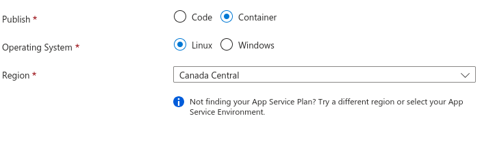

# Azure-Python-Container-Deployment

**A Practical Example of Deployment of a Python Application with Azure Container Registry**

The purpose of this example is to illustrate how to deploy a Python application using [Azure Container Registry](https://azure.microsoft.com/en-us/products/container-registry) (ACR). While this example focuses on ACR, the principles can be applied to other container registries with minor adjustments.

## Requirements

- **Azure CLI**: Version 2.59.0 or higher. The easiest way for Python developers is to install it via pip:
  ```bash
  pip install azure-cli
  ```
- **Private Fork of the Example Package**: Clone the private fork of the example package from GitHub, accessible 
- **Personal Access Token (PAT)**: A PAT is required to access the private fork.

## Create the Private Requirements File

Generate the `requirements.txt` file by substituting the appropriate values:

```bash
cat requirements.tmplt.txt | DOMAIN="github.com" ROUTE="<route to repository>" envsubst '$DOMAIN $ROUTE' > requirements.txt
```

Ensure the PAT environment variable is set:

```bash
export PAT=<your_personal_access_token>
```

## Azure Container Registry

### Enable Admin Access (if not already enabled)

If admin access is not enabled, you can enable it:

```bash
az acr update -n <name_of_container_registry> --admin-enabled true
```


### Log in to the Container Registry

Log in to the ACR:

```bash
az acr login --name <name_of_registry>
```

If you are using Podman instead of Docker:

```bash
DOCKER_COMMAND=podman az acr login --name <name_of registry>
```

### Building the Application


Build the Docker image and push it to the ACR.

**Note**: This build process occurs on Azure infrastructure, which is different from a local build on your machine. When building on Azure, it is crucial to handle secrets securely. Unlike a local build, where you are typically the only one who sees the logs, logs from Azure builds can be visible to other users if not properly managed. Ensure that you use secure methods.

```bash
az acr build \
    --secret-build-arg PAT=$PAT \
    --t example/demoapp:py3.11-0.1.0 \
    --registry <registry_name> \
    --file Dockerfile \
    .
```

## Azure Portal

### Create a Web Application from Container

1. **Create a Web App**:
   - Navigate to the Azure Portal.
   - Create a new Web App and select the container option.
   - Follow the prompts to configure your web app using the container image from your ACR.

   

## Conclusion

To ensure the security of your deployment, use the `--quiet` flag with `pip install` when using `--secret-build-arg` and environment variables. This prevents secrets from being logged if dependencies are installed from a private package:

```bash
pip install --quiet -r requirements.txt
```

